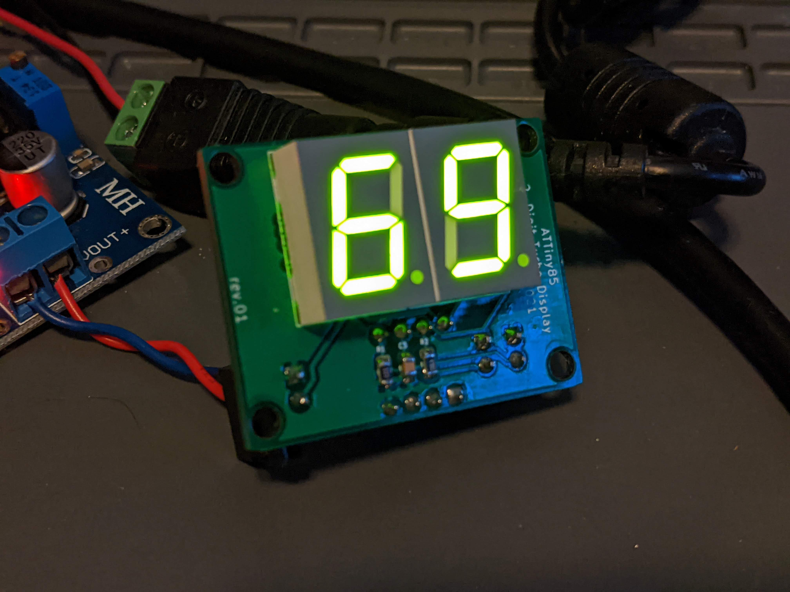

# 2 digit Turbo Display
This project is a ATTiny85-based turbo display for retro PC's. It displays 2 digits, for use in 8088 to 486 systems.

## Intro
I was wanting to do an ATTiny85 project and came up with a small 2-digit turbo display for use in my Intel 486 retro gaming PC. This design is pretty simple, easy to build and easy to program. If you have a dead turbo display or your case is missing one, this might be the right fit, as I have tested it on 3 different cases I have and it fits perfect into all of them. Mounting holes are different in nearly every case, so another mounting method may be necessary depending on your situation.
 
Demo Video: https://youtu.be/Jka8PfParP4

## Building
* Order the PCB through your PCB fab of choice. (JLCPCB, PCBway, OSH Park, etc.)
* Order the components as listed in the BOM. Substitutions may be necessary depending on the chip/component shortages.
* On the back side and front side, solder the surface mount components first. Pay close attention to the orientation of the SOIC chips, as they are reversed from each other on the right and left.
* On the back side, solder the through-hole components next. I recommend using a socket for the ATTiny85 so you can easily install/remove it for programming.
* On the front side, solder the LED 7-segment displays.
* Soldering complete. Go to the Programming section below.

## Programming
I have included the turbo.ino file as an example. In the main program loop, you can change the "normal" and "turbo" variables to any 2 digit number to match the needs of your particular CPU speeds. The code is pretty well commented, so you can play around with it, adjust delays, make a startup animation, etc. To program the ATTiny85, you can look at one of the hundreds of guides online. For mine, I used a breadboard and another Arduino to do so. After it is programmed, place it in the DIP-8 socket of the turbo display PCB.

## Installation
* As noted in the intro section, this was designed to fit in the Baby-AT cases I have. It seems there was no standard back in the day for making these turbo displays or mounting them, so each case can be different. The digit size fits all mine that have 2-digit display holes, and at least one mounting hole fits on two of the cases. Only one screw is really necessary anyway since it is so small and light. You can secure it in your case with various methods. (tape, blu tack, 3d printed clip, etc.)
* Once mounted in the case, connect the 5V power to a Berg/Molex-->2x2.54mm header. 
* Connect the Turbo LED on your case to the TLED OUT pins.
* Use a female to female cable with 2x2.54mm connectors at each end to connect the motherboard's Turbo LED pins to the turbo display board's TLED IN. These are commonly found on Aliexpress, Amazon, and Ebay for use in Arduino/RPi projects.
* The turbo switch on your case should be connected to the computer's motherboard Turbo Switch pins.
* Turn on the PC and test it out!

## Design Notes
The design takes into account that your motherboard has turbo LED pins to drive switching of this display. I found this to be the most common feature among all motherboards, from the 8088 to 486. I probably own 25 different boards of this era, and they all have the pins to drive a turbo LED. This is the most universal design I could come up with.

## Other
This is an open source project. Feel free to do what you want with it.
